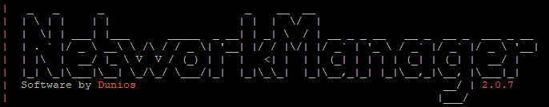

# NetworkManager (BungeeCord/Velocity)



### Requirements

1. Make sure you have Java 8, 11, 16 or 17 installed!​
2. BungeeCord Server that is configured.
3. MySQL (8 or newer) Server with a database and a user account. (If your MySQL Server is on a other server then your Web Server you need to allow remote connections on your MySQL Server.) (MariaDB 10.3 or newer Recommended (MariaDB is a fork of MySQL)).

### Installation

1. Drop the plugin ([NetworkManager](https://www.spigotmc.org/resources/networkmanager.28456/)) in your BungeeCord or Velocity ([Velocity builds](https://discord.com/channels/222070253172031500/1094976246376566884)) plugins folder.
2. Start your BungeeCord/Velocity server.
3. Open the settings.yml located at /plugins/NetworkManager/settings.yml.
4. Enter your MySQL host, port, username, password and database.
5. (Optional) Enable Redis. Enter redis host and password if you set one.
6. Restart your BungeeCord/Velocity server. It will now create tables and insert some data into it.
7. Execute "nm test database" in the console to test the connection. If the command is unknown check your bungeecord log.


Don't join the server yet! Install the Web Interface now. After you installed the WebInterface go to the Settings in the web interface and search for servermode. Make sure you've set the correct servermode. \
\
You can choose: ONLINE, OFFLINE or MIXED.


### Settings explained

The settings.yml has a couple of settings.

```yaml
storage:
  type: MYSQL # You can choose between MYSQL or MARIADB
  host: localhost
  port: 3306
  username: NetworkManager
  password: NetworkManager
  database: NetworkManager
  pool-settings:
    maximum-pool-size: 10
    minimum-idle: 10
    maximum-lifetime: 1800000
    connection-timeout: 5000
redis:
  enabled: true
  host: localhost
  port: 6379
  password: ''
rabbitmq:
  enabled: false
  host: localhost
  port: 5672
  vhost: /
  username: ''
  password: ''
```

### Common issues

1. If you see something like this: "Could not create connection to database server. Attempted reconnect 3 times. Giving up." it means it couldn't connect to your MySQL database. Check in the setting.yml if you have set the correct settings.
