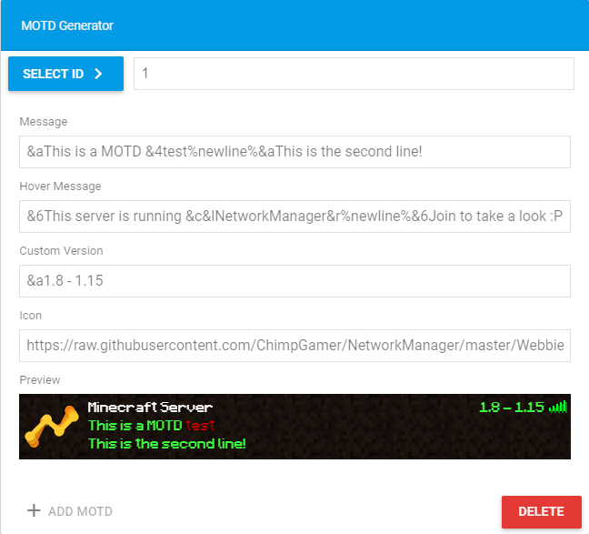

# MOTD

* Select ID - Here you can select the other MOTD's you created.
* Message - The message is your Motd text. It can only contain 2 lines of text. You can use %newline% to go to the second line of your motd.
* Hover Message - This is the message you get when you hover over the player count or "Custom Version". You can use colorcodes and create as much new lines as you want.
* Custom Version - This removes your player count of the motd and will put a custom version instead. If you remove the Custom Version the player count will pop-up again.
* Icon - Your server icon has to be a valid web url. The size doesn't matter. If the icon is in 4k NetworkManager will down scale it to 64x64 which is the correct size of an motd icon.
* Add MOTD - This will add a new MOTD to the list.
* Delete - This will delete your currently selected MOTD \(Requires confirmation\).

